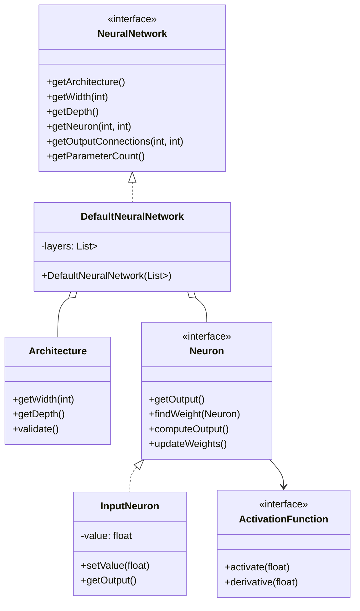
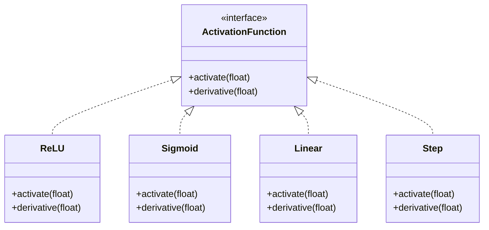
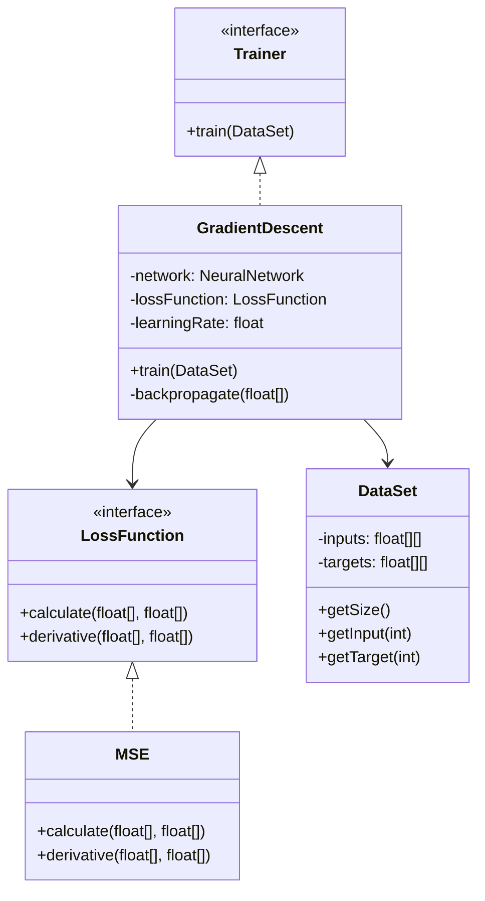
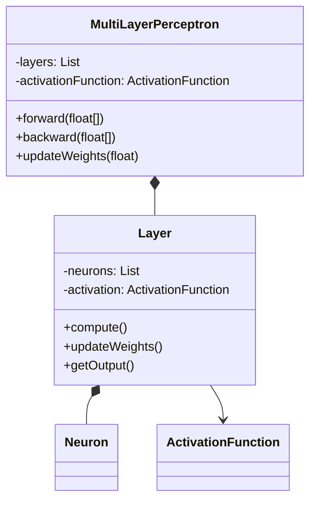
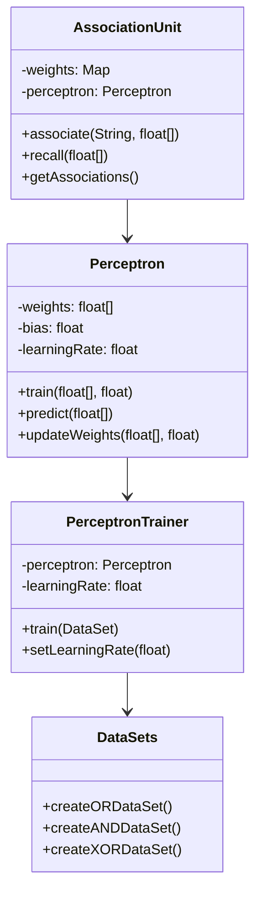
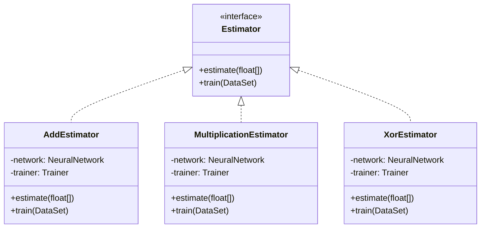
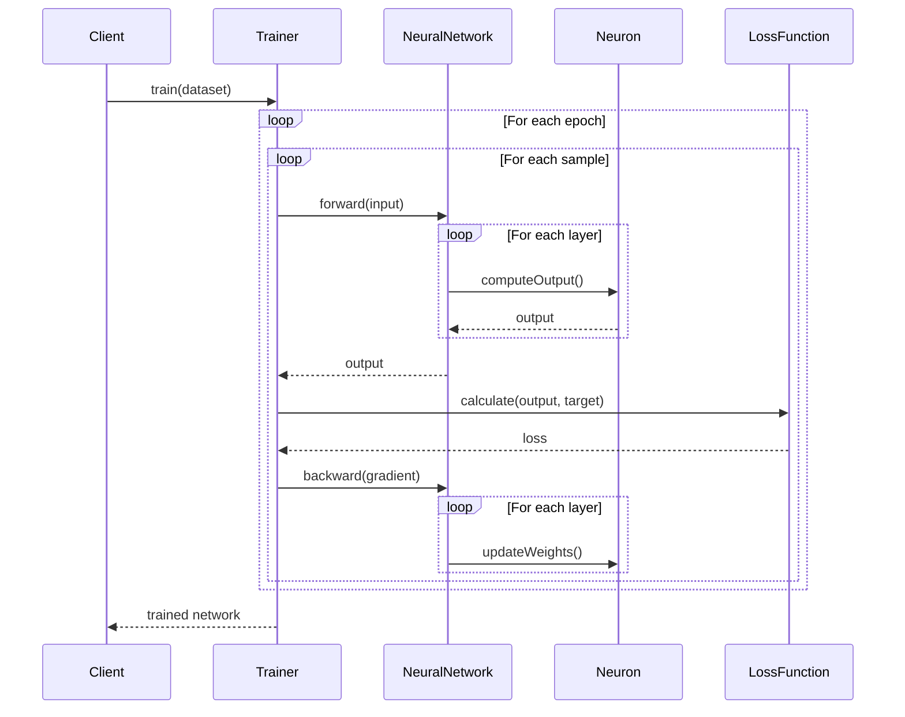
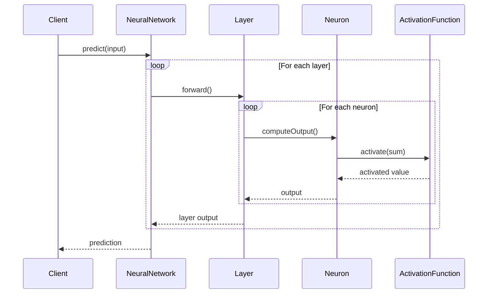
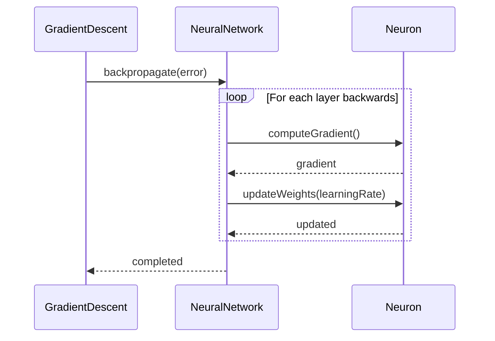

# Neural Network Implementation Diagrams

This document contains detailed class and sequence diagrams for each module of the neural network implementation.

## Core Model Module

### Neural Network Core Components

### Activation Functions

### Training Components

## Multi-Layer Perceptron Module

## Perceptron Module

## Functions Module

## Sequence Diagrams

### Training Process

### Prediction/Inference Process

### Weight Update Process

